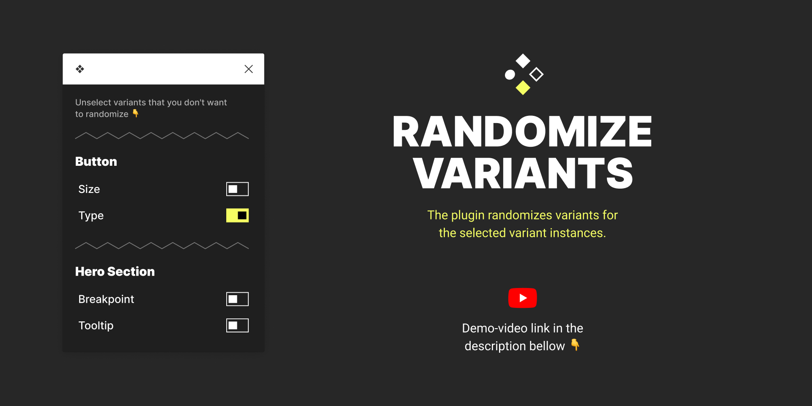

# Variants Randomizer

The plugin randomizes variants for the selected variant instances.

## Features

- Randomise multiple variants
- Restrict duplicates
- Choose which properties you want to use

---

### 🎥 [Youtube demo](https://youtu.be/zc8qcvYaj6w)

### 🍰 [Install plugin](https://www.figma.com/community/plugin/981938541965949273/Variants-Randomizer)
